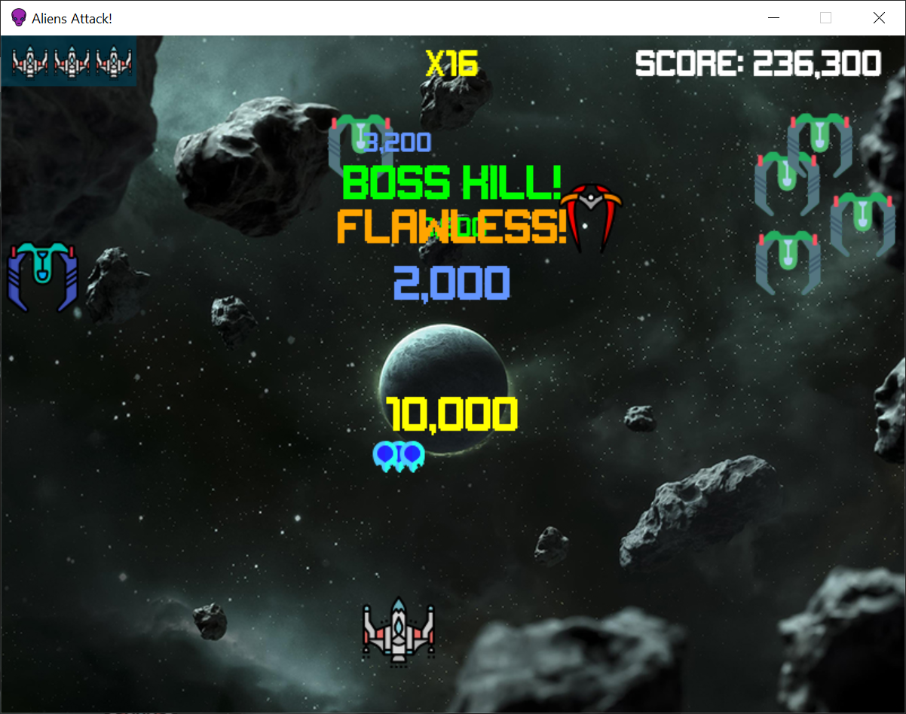

# Aliens Attack: Arcade Evolution 🚀

Day 10 of the Python course — a classic arcade shooter built with **pygame-ce** featuring intense combat, dual scoring multipliers, and massive boss encounters.

## How to Play

| Key | Action |
|-----|--------|
| **WASD** | Move ship |
| **Space** | Fire fireballs (Hold for auto-fire) |
| **P** | Pause / Resume |
| **H** | Open Mission Intel / Rules (from main menu) |
| **R** | Quick restart (on game over screen) |
| **ESC** | Exit game |

## Game Preview

### 🎮 Gameplay Action

## Cool Features

- **Double Multiplier System**: 
  - **Skill Combo (x1 to x16)**: Kills without dying grow your combo. Resets back to x1 when you take a hit. High combo = massive score bonuses on normal invaders and boss hits!
  - **Background Difficulty**: Scales up to 3x based on your overall score. Speeds up enemy spawn rates and boss pacing.
- **Dynamic Boss Battles**:
  - **Regular & Mega Bosses**: Spawn at score milestones. The intervals get wider at higher scores to give you breathing room.
  - **Erratic Mega Boss**: Moves much faster, evades randomly, and shoots animated, plasma-flopping dual lasers!
  - **Flawless Victory**: Kill a boss without losing a life to earn a glowing **"FLAWLESS!"** alert and a giant point bonus (+2k for regular, +5k for mega).
  - **Overrun Mode**: Once you cross 1 Million points, enemies will **no longer despawn** when bosses arrive!
- **High-Priority Alerts**: Life changes and flawless popups now render on top of every other game object and score alert.
- **Overshield (Cyan Bar)**: Earned every 100k points. Absorbs 2 free hits before you lose lives. Plays `fail.mp3` when damaged to warn you.
- **Triple Shot**: Earned at milestones or when gaining extra lives at full HP. Blasts three fireballs at once for 20 seconds.
- **Squadron Phasing**: At 1 Million points, standard invaders phase out entirely, leaving only Level 3 Ace Ships.

## File Breakdown

- `main.py`: Game entry point.
- `game.py`: Handles main loop, collision logic, and screens.
- `player.py`: Ship movement, auto-fire, triple shot, and shields.
- `enemy.py`: Spawning, variant scaling, and explosion sheets.
- `boss.py`: Randomized boss textures, movement patterns, and custom explosions.
- `sound_manager.py`: Audio loading, volume levels, and prioritized sound channels.
